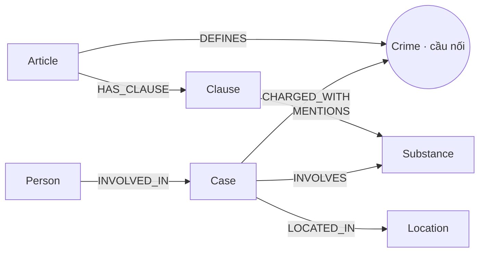

# Thiết kế Ontology — Day 19

**Lựa chọn:** Dùng ontology gợi ý trong `src/graph.py`. Thiết kế này đáp ứng đường nối giữa hai KB qua `Crime`; chưa nhận bonus ontology tự thiết kế.

## 1. Sơ đồ

`Crime` được dùng chung: luật định nghĩa tội danh, tin tức gắn vụ việc với cùng tội danh đã chuẩn hóa.

## 2. Entity types

| Label | Ý nghĩa | Khóa MERGE | Properties chính | Nguồn | Trích xuất |
| --- | --- | --- | --- | --- | --- |
| Article | Điều luật | `id` (tên Điều + bộ luật) | `title`, `law`, `doc_id` | Luật | Metadata + regex |
| Clause | Khoản trong Điều | `id` (Điều + số khoản) | `number`, `penalty`, `text`, `doc_id` | Luật | Regex |
| Crime | Tội danh chuẩn | `name` | `name` | Luật và tin | Regex; LLM rồi `link_entity` |
| Case | Vụ việc | `name` do trích xuất đặt | `summary`, `date`, `doc_id`, `source_title` | Tin | LLM JSON |
| Substance | Chất ma túy chuẩn | `name` | `name` | Luật và tin | Regex dò từ điển; LLM JSON |
| Location | Địa điểm | `name` | `name` | Tin | LLM JSON |
| Person | Người liên quan | `name` | `aliases` | Tin | LLM JSON |

Node được tạo cho tài liệu cụ thể (Article, Clause, Case) mang `doc_id = Document.id`. Các node dùng chung làm cầu nối (Crime, Substance) không gắn một `doc_id` duy nhất.

## 3. Relationships

| Type | Từ → Đến | Properties | Ý nghĩa |
| --- | --- | --- | --- |
| DEFINES | Article → Crime | — | Điều luật quy định tội danh |
| HAS_CLAUSE | Article → Clause | — | Điều luật có khoản |
| MENTIONS | Clause → Substance | — | Khoản luật nêu chất |
| CHARGED_WITH | Case → Crime | — | Vụ việc có tội danh được cáo buộc/truy tố |
| INVOLVES | Case → Substance | `amount` | Vụ việc liên quan chất và khối lượng |
| LOCATED_IN | Case → Location | — | Địa điểm vụ việc |
| INVOLVED_IN | Person → Case | `role`, `charge`, `sentence` | Người và vai trò trong vụ việc |

## 4. Node cầu nối giữa 2 KB

- **Node:** `Crime`.
- **Lý do:** Tên tội danh xuất hiện trong tiêu đề điều luật và trong dữ kiện tin tức; đây là thuộc tính ngữ nghĩa chung của hai KB.
- **Khớp tên:** lấy tội danh chuẩn từ tiêu đề luật; đưa danh sách chuẩn vào prompt trích xuất tin; chuẩn hóa chữ thường, dấu câu và tiền tố `Tội`; thử khớp chính xác trước, rồi fuzzy match với cutoff 0.8.
- **Khi cầu gãy:** LLM không chọn tội danh đúng hoặc fuzzy match dưới ngưỡng thì `link_entity` trả `None`; tin vẫn được nạp nhưng không có cạnh `CHARGED_WITH` tới `Crime`. Cần rà lại charge và danh sách chuẩn, không tự nối một tội danh gần nghĩa.

## 5. Competency questions

| Câu | Đường đi / truy vấn logic | Trả lời được? |
| --- | --- | --- |
| Q1 | Article seed → HAS_CLAUSE → Clause; đọc nội dung khoản có cụm “tiền chất”. | Có thể truy xuất đoạn luật; ontology chưa có node `Precursor` riêng. |
| Q2 | Case ← INVOLVED_IN — Person; đọc `sentence`, `role` và `charge`. | Có điều kiện nếu LLM trích xuất đủ người và mức án. |
| Q3 | Person → Case → Crime ← Article → Clause 1; đọc `sentence` và `penalty`. | Có điều kiện, phụ thuộc cầu `Crime` và trích xuất người. |
| Q4 | Case → Crime ← Article → Clause; dùng tên/biệt danh người để tìm Case, lấy khoản cao nhất. | Có điều kiện; phần “tối đa” hiện dựa vào các khoản luật trả về, không có thuộc tính max riêng. |
| Q5 | Person → Case → Crime ← Article → Clause; Case → INVOLVES → Substance; Clause → MENTIONS → Substance. Lọc khoản có cùng chất và đọc ngưỡng trong `text`. | Có điều kiện; ngưỡng khối lượng nằm trong văn bản tự do, chưa được parse thành số. |
| Q6 | Substance ← INVOLVES — Case; liệt kê tên và summary các Case. | Có điều kiện; chất phải được LLM trích xuất về tên chuẩn. |

## 6. Quyết định thiết kế và đánh đổi

1. **Dùng `Crime` làm cầu nối.** So với nối thẳng Case–Article, node này biểu diễn đúng tội danh và cho phép nhiều vụ cùng liên kết một điều luật; đổi lại, sai chuẩn hóa sẽ làm gãy đường đi.
2. **Regex cho luật, LLM cho tin.** Văn bản luật có cấu trúc khoản ổn định nên regex rẻ và lặp lại được; tin tức tự do cần LLM nên có chi phí và có thể bỏ sót hoặc điền sai.
3. **Tách khoản thành `Clause`, giữ nguyên `text` và `penalty`.** Cách này cho phép truy vấn khung cơ bản và khoản liên quan chất; đổi lại, các ngưỡng trong câu chữ chưa thành dữ liệu số có thể truy vấn chính xác.
4. **MERGE Case và Person theo tên.** Cách này dễ thực hiện và hỗ trợ lookup theo tên; tên do LLM đặt có thể thiếu ổn định, trùng người hoặc gộp nhầm vụ khác nhau.

## 7. So với ontology gợi ý

Không xét bonus: repo sử dụng ontology gợi ý, không tuyên bố có cải tiến ontology so với mẫu.

## 8. Hạn chế còn lại

- Chưa chuẩn hóa alias của chất (ví dụ tên hóa học và tên đường phố) thành một khóa riêng.
- Case và Person dùng tên do LLM tạo làm khóa; nên có khóa dựa trên nguồn, ngày, địa điểm và alias để tránh gộp nhầm.
- Regex nhận diện chất theo chuỗi con, có thể bỏ sót biến thể hoặc khớp nhầm từ.
- Ngưỡng khối lượng và giai đoạn tố tụng chưa được mô hình hóa; `charge`/`sentence` có thể rỗng khi bài báo không nêu.
- Đã kiểm tra graph thật sau extraction/benchmark: 7 label (`Article`, `Case`, `Clause`, `Crime`, `Location`, `Person`, `Substance`) và 7 relationship type (`CHARGED_WITH`, `DEFINES`, `HAS_CLAUSE`, `INVOLVED_IN`, `INVOLVES`, `LOCATED_IN`, `MENTIONS`), tương ứng 199 node và 380 cạnh. `Crime` tạo được đường xuyên KB; benchmark và kết quả thực tế được ghi ở `REPORT_KG.md` và `ket_qua_benchmark_kg.txt`.
- `charge` rỗng không đồng nghĩa chắc chắn với lỗi trích xuất: tin có thể nêu người liên quan nhưng không cáo buộc tội ma túy, hoặc chỉ nói về tội ngoài tập luật của lab. Nên lưu charge gốc và trạng thái trích xuất riêng.
- Neo4j đang chạy với graph đầy đủ để chụp ảnh nộp bài. Ba ảnh vẫn cần được lưu vào `report/img/`.
